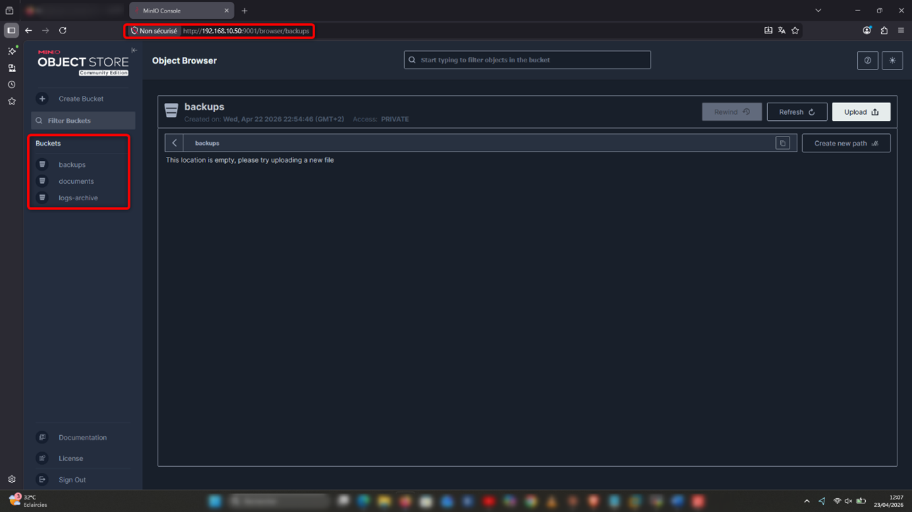
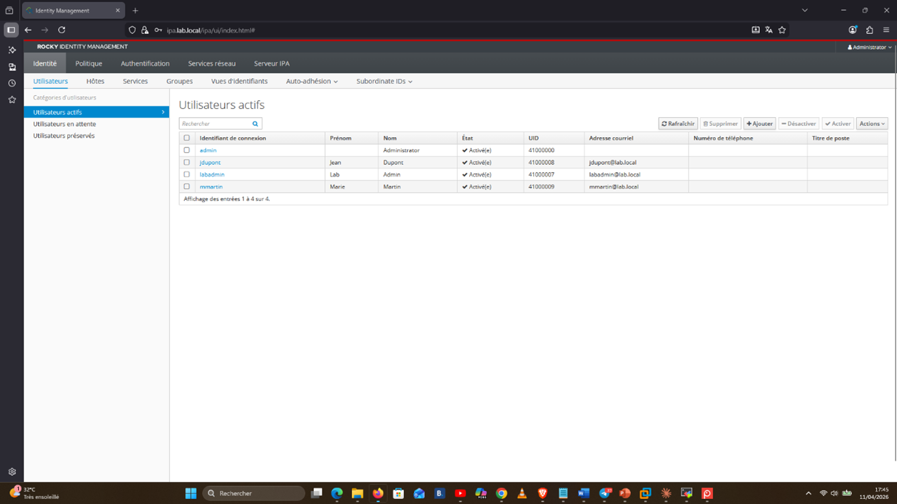
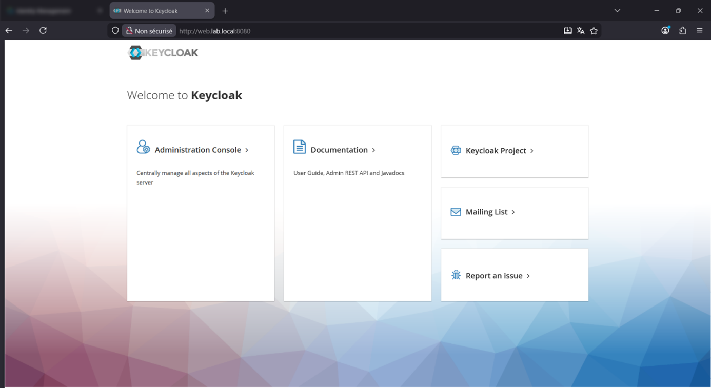
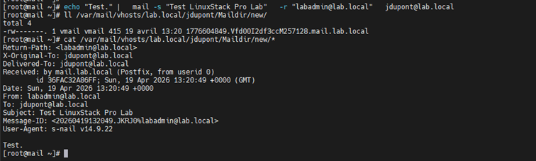
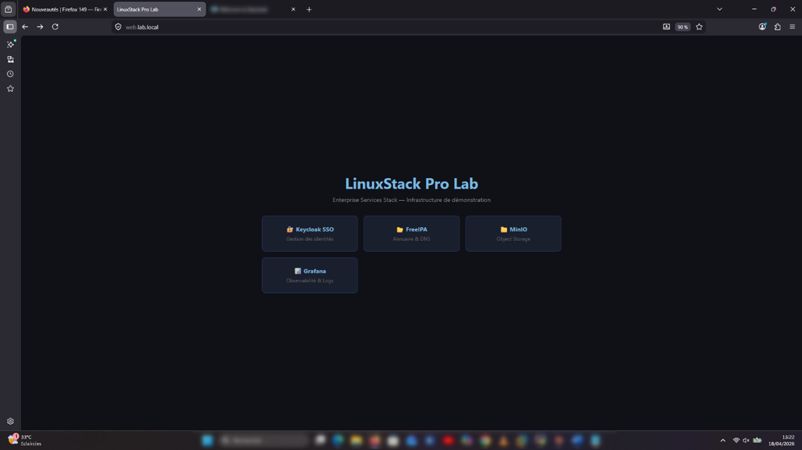
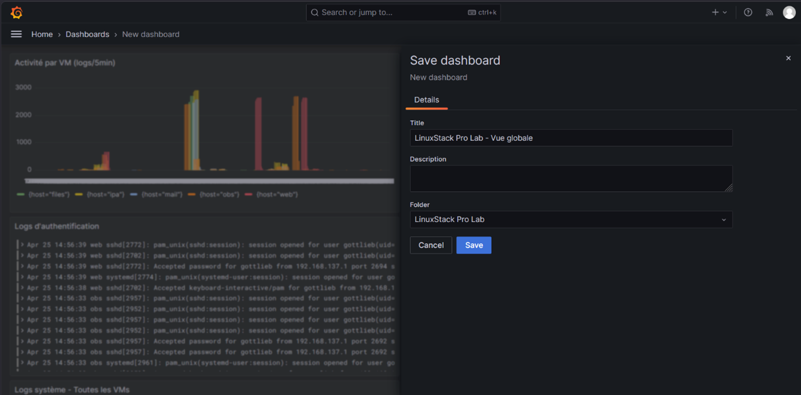

# LinuxStack Pro Lab 🐧

Enterprise Services Stack - Full Deployment Guide



 



---

## 📋 Overview

LinuxStack Pro Lab is a production-grade Linux enterprise infrastructure deployed entirely in a virtualized environment (VMware Workstation). It covers identity management, web services, secure mail, file transfer, observability, and security hardening — all automated with Ansible.

This project is designed as a fully reproducible lab for system administrators and DevOps engineers looking to build real-world Linux infrastructure skills.

---

## 🏗️ Architecture

[Network Diagram](docs/images/NetworkDiagram.png)

| VM             | Hostname            | Roles                      | IP              |
|----------------|---------------------|----------------------------|-----------------|
| vm-ansible     | ansible.lab.local   | Anisble Controller         | 192.168.100.10  |
| vm-ipa         | ipa.lab.local       | FreeIPA + DNS              | 192.168.100.20  |
| vm-web         | web.lab.local       | Nginx + Keycloak           | 192.168.100.30  |
| vm-mail        | mail.lab.local      | Postfix + Dovecot + Rspamd | 192.168.100.40  |
| vm-files       | files.lab.local     | SFTP + MinIO               | 192.168.100.50  |
| vm-obs         | obs.lab.local       | Loki + Promtail + Grafana  | 192.168.100.60  |

---

## 🛠️ Stack

| Category             | Technology                                  |
|----------------------|---------------------------------------------|
| Identity & Auth      | FreeIPA, Keycloak (SSO/OIDC/SAML)           |
| Web & Proxy          | Nginx, SSL/TLS (mkcert)                     |
| Mail                 | Postfix, Dovecot, Rspamd                    |
| File Transfer        | OpenSSH SFTP, MinIO (S3-compatible)         |
| Observability        | Promtail, Loki, Grafana                     |
| Security             | Fail2Ban, Firewalld, Lynis, SSH hardening   |
| Automation           | Ansible, Ansible Vault, Jinja2 templates    |
| Containers           | Docker, Docker Compose                      |
| OS                   | Rocky Linux 9                               |
| Virtualization       | VMware Workstation 17                       | 

---

## ⚙️ Prerequisites

Host Machines
| Resource        | Minimum     | Recommended  |
|-----------------|-------------|--------------|
| RAM             | 16 GB       | 24 GB        |
| Disk            | 200 GB      | 500 GB       |
| CPU             | 4 cores     | 8 threads    |

Software

VMware Workstation 17+

Rocky Linux 9 ISO → https://rockylinux.org/download

---

## 🚀 Quick Start

###1. Clone the repository

git clone https://github.com/davidgottlieb13/linuxstack.git

cd linuxstack

###2. Create the VMs

Follow **Chapter 1** of the deployment guide to create and configure the 6 VMs with Rocky Linux 9.

### 3. Bootstrap vm-ansible

On vm-ansible

dnf install -y epel-release ansible

git clone https://github.com/davidgottlieb13/linuxstack.git ~/linuxstack

cd ~/linuxstack

### 4. Configure SSH access

ssh-keygen -t ed25519 -C "ansible@lab.local" -f ~/.ssh/id_ed25519 -N ""

for ip in 20 30 40 50 60; do

  ssh-copy-id -i ~/.ssh/id_ed25519.pub root@192.168.100.${ip}

### 5. Configure secrets

cp group_vars/vault.yml.example group_vars/vault.yml

ansible-vault encrypt group_vars/vault.yml

---

## 📁 Repository Structure
```
linuxstack
├── ansible.cfg
├── ansible.log
├── docs
│   ├── Deployment_Guide.pdf
│   └── images
│       ├── FileServer.png
│       ├── FreeIPA.png
│       ├── Keycloak.png
│       ├── MailServer.png
│       ├── ReverseProxy_Web.png
│       └── Visualization.png
├── host_vars
├── inventory
│   ├── group_vars
│   │   ├── all.yml
│   │   └── vault.yml
│   └── hosts.ini
├── LICENSE
├── playbooks
│   ├── audit_lynis.yml
│   ├── base_config.yml
│   ├── deploy_fail2ban.yml
│   ├── deploy_files.yml
│   ├── deploy_keycloak.yml
│   ├── deploy_logwatch.yml
│   ├── deploy_mail.yml
│   ├── deploy_nginx.yml
│   ├── deploy_plg.yml
│   ├── deploy_promtail.yml
│   ├── final_report.yml
│   ├── final_report.yml.bak
│   ├── harden_firewall.yml
│   ├── harden_ssh.yml
│   ├── join_domain.yml
│   ├── ping_all.yml
│   ├── security_all.yml
│   ├── set_dns.yml
│   ├── templates
│   │   ├── index.html.j2
│   │   ├── jail.local.j2
│   │   ├── nginx.conf.j2
│   │   ├── promtail-config.yml.j2
│   │   ├── ssh_banner.j2
│   │   ├── sshd_hardened.conf.j2
│   │   └── web.lab.local.conf.j2
│   └── validate_all.yml
├── README.md
├── reports
│   ├── lynis-vm_files.dat
│   ├── lynis-vm_ipa.dat
│   ├── lynis-vm_mail.dat
│   ├── lynis-vm_obs.dat
│   └── lynis-vm_web.dat
├── roles
└── templates
    ├── index.html.j2
    ├── jail.local.j2
    ├── nginx.conf.j2
    ├── promtail-config.yml.j2
    ├── ssh_banner.j2
    ├── sshd_hardened.conf.j2
    └── web.lab.local.conf.j2
```

---

## 📖 Documentation

The full step-by-step deployment guide is available in [Deployment_Guide](docs/Deployment_Guide.pdf).

It covers:

| Chapter | Content                                 |
|---------|-----------------------------------------|
| 0       | Introduction & Overview                 |
| 1       | VMware Environment Setup                |
| 2       |  Ansible Control Node                   |
| 3       | FreeIPA Directory & DNS                 |
| 4       | Keycloak SSO & IAM                      |
| 5       | Nginx Reverse Proxy & SSL               |
| 6       | Mail Server (Postfix + Dovecot + Rspamd)|
| 7       | File Transfer (SFTP + MinIO)            |
| 8       | Observability (PLG Stack)               |
| 9       | Security Hardening                      |
| 10      | Global Validation & Integration Tests   |

---

## 🔐 Security Notes

- All secrets are managed via **Ansible Vault** — never commit `vault.yml` in plaintext

- SSL/TLS is enforced on all services using **mkcert** for local CA

- **Fail2Ban** protects SSH, SMTP, IMAP, and Nginx on all VMs

- **Firewalld** applies strict per-VM rules — only required ports are open

- **Lynis** audit scores 60+ across all VMs

> ⚠️ **This lab uses self-signed certificates and simplified configurations suitable for learning environments. Do not use as-is in production.**

---

## 🤝 Contributing

Contributions are welcome! Please open an issue first to discuss what you would like to change.

1. Fork the repository
2. Create your feature branch (`git checkout -b feature/my-feature`)
3. Commit your changes (`git commit -m 'Add my feature'`)
4. Push to the branch (`git push origin feature/my-feature`)
5. Open a Pull Request

---

## 📄 License

This project is licensed under the MIT License — see the [LICENSE](LICENSE) file for details.

---

## 👤 Author

Made by **David Gottlieb**

[LinkedIn](https://www.linkedin.com/in/davidgottliebsitti/)

[GitHub](https://github.com/davidgottlieb13)

---

> *"The best way to learn Linux enterprise administration is to build it yourself."*

